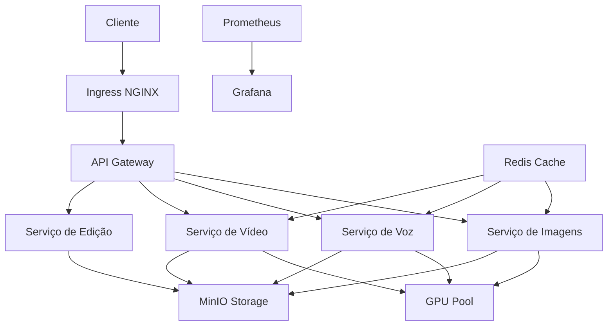

# Documentação Técnica - Sistema de Geração de Conteúdo com IA

## Sumário
1. [Visão Geral](#visão-geral)
2. [Arquitetura do Sistema](#arquitetura-do-sistema)
3. [Árvore de Tecnologias](#árvore-de-tecnologias)
4. [Componentes Principais](#componentes-principais)
5. [Configuração e Deployment](#configuração-e-deployment)
6. [Monitoramento e Observabilidade](#monitoramento-e-observabilidade)

## Visão Geral

O sistema é uma plataforma distribuída de geração de conteúdo usando IA, projetada para processar requisições de geração de imagens, áudio e vídeo em larga escala. O sistema utiliza múltiplas GPUs e é otimizado para alta performance e confiabilidade.

### Principais Funcionalidades
- Geração de imagens com Stable Diffusion XL
- Síntese de voz com Fish Speech
- Geração de vídeos com FastHunyuan
- Edição automatizada de vídeos
- Sistema de templates para configurações predefinidas
- Gerenciamento dinâmico de recursos GPU
- Monitoramento em tempo real

## Arquitetura do Sistema



## Árvore de Tecnologias

```
Sistema de Geração de Conteúdo
├── Backend Framework
│   ├── FastAPI
│   └── Pydantic (Validação)
├── IA e ML
│   ├── PyTorch
│   │   ├── CUDA 12.2+
│   │   └── MPS (Apple Silicon)
│   ├── Diffusers
│   │   ├── SDXL
│   │   ├── ControlNet
│   │   └── LoRA
│   ├── Fish Speech (TTS)
│   └── FastHunyuan (Vídeo)
├── Infraestrutura
│   ├── Kubernetes
│   │   ├── GPU Operator
│   │   └── HPA
│   ├── Docker
│   └── NGINX Ingress
├── Storage
│   ├── MinIO (S3)
│   └── Redis (Cache)
├── Monitoramento
│   ├── Prometheus
│   ├── Grafana
│   └── OpenTelemetry
└── Segurança
    └── JWT Authentication
```

## Componentes Principais

### 1. Serviço de Geração de Imagens
- **Tecnologia Principal**: Stable Diffusion XL
- **Otimizações**:
  - Torch Compile para JIT
  - Attention Slicing
  - VAE Tiling
  - CUDA Optimizations
- **Features**:
  - Suporte a ControlNet
  - Integração com LoRAs
  - Templates customizáveis
  - Schedulers configuráveis

### 2. Serviço de Geração de Voz
- **Tecnologia Principal**: Fish Speech
- **Features**:
  - Clonagem de voz
  - Múltiplos idiomas
  - Controle de pitch e velocidade
  - Templates de voz

### 3. Serviço de Geração/Edição de Vídeo
- **Tecnologias**:
  - FastHunyuan para geração
  - FFmpeg para edição
- **Features**:
  - Geração de vídeos a partir de prompts
  - Edição automatizada
  - Remoção de silêncio
  - Templates de edição

## Configuração e Deployment

### Requisitos de Sistema
- Kubernetes 1.25+
- NVIDIA GPUs (RTX 4090 recomendado)
- 32GB+ RAM por node
- Ubuntu 22.04 LTS ou superior

### Deployment
```bash
# Instalação via Helm
helm repo add content-api https://charts.content-api.com
helm install content-api content-api/content-generator

# Configuração de GPUs
kubectl apply -f https://raw.githubusercontent.com/NVIDIA/k8s-device-plugin/master/nvidia-device-plugin.yml
```

### Variáveis de Ambiente Principais
```yaml
API_TOKEN: "seu_token_aqui"
CUDA_VISIBLE_DEVICES: "0,1,2,3"
MINIO_ACCESS_KEY: "access_key"
MINIO_SECRET_KEY: "secret_key"
REDIS_URL: "redis://redis:6379"
```

## Monitoramento e Observabilidade

### Métricas Principais
- GPU Utilization
- VRAM Usage
- Request Queue Size
- Generation Time
- Error Rate

### Dashboards Grafana
- GPU Performance
- API Latency
- Queue Status
- Storage Usage

### Logs
Centralizados via OpenTelemetry com exportação para:
- Elasticsearch
- Loki
- CloudWatch

## Referências

- [FastAPI Documentation](https://fastapi.tiangolo.com/)
- [PyTorch Documentation](https://pytorch.org/docs/)
- [Kubernetes Documentation](https://kubernetes.io/docs/)
- [Stable Diffusion Documentation](https://huggingface.co/docs/diffusers/index)
- [Fish Speech Documentation](https://github.com/fishaudio/fish-speech)
- [FastHunyuan Documentation](https://github.com/FastHunyuan/video-generation) 